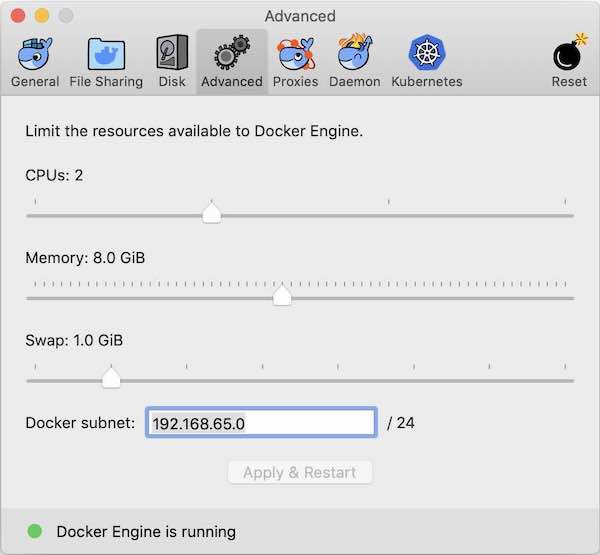

# Workshop de Big Data con Apache Spark [🇪🇸]
Material del Workshopde Big Data

## Contenidos
* [Levantar el ambiente](#levantar-ambiente)
* [Batch Processing](README-batch.md)
* [Structured Streaming Processing](README-streaming.md)

## Infrastructura

El workshop simula una instalación de producción utilizando container de Docker.
[docker-compose.yml](docker-compose.yml) contiene las definiciones y configuraciones para esos servicios y sus respectivas UIs:

* Apache Spark: [Spark Master UI](http://localhost:8080) | [Job Progress](http://localhost:4040)
* Apache Kafka:
* Postgres:
* [Superset](http://superset.incubator.apache.org): [Nuestro Dashboard](http://localhost:8088/)

Los puertos de acceso a cada servicio quedaron los defaults. Ej: **spark master:7077**, **postgres: 5432**

## Levantar ambiente

Instalar el ambiente [siguiendo las instrucciones acá](INSTALL.md).

Correr el script que levanta el ambiente `Usage: control-env.sh (start|stop|cleanup)`:

```bash
./control-env.sh start

**IMPORTANTE** el script `control-env.sh cleanup` borra cualquier dado que haya sido procesado anteriormente.


# Access Spark-Master and run spark-shell
docker exec -it master bash
root@588acf96a879:/app# spark-shell
```
Probar:
```scala
val file = sc.textFile("/dataset/yahoo-symbols-201709.csv")
file.count
file.take(10).foreach(println)
```
Acceder a http://localhost:8080 y http://localhost:4040 para ver la SPARK-UI.

### Troubleshooting

Si los jobs mueren (`KILLED`) y no se completan puede ser debido a la memória disponible para Docker, **aumente la memoria > 8Gb** al proceso de Docker:



#### Alternativamente se puede probar usando la consola de [pySpark](README-pyspark.md)

# Siga leyendo
* [Introducción a Scala](scala/README.md)
* [Batch Processing](README-batch.md)

## Sobre
Gustavo Arjones &copy; 2017-2019  
[arjon.es](https://arjon.es) | [LinkedIn](http://linkedin.com/in/arjones/) | [Twitter](https://twitter.com/arjones)
