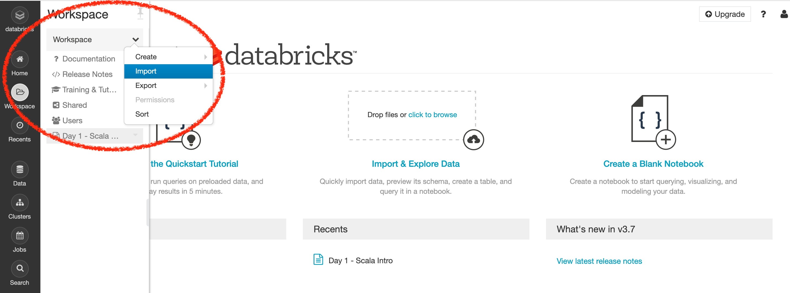
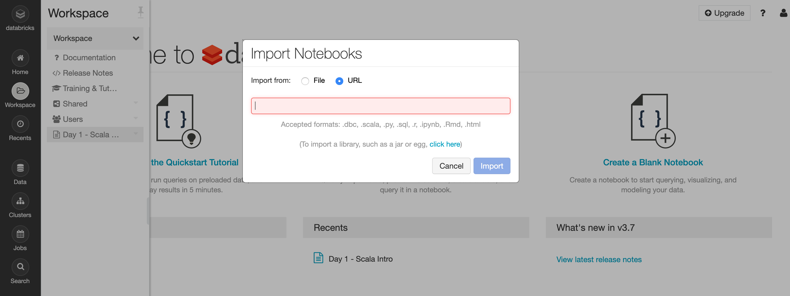

# Databricks Notebook

1. Crear una cuenta en [Databricks | COMMUNITY EDITION](https://databricks.com/try-databricks)

2. Importar el Notebook:

3. Agregar la URL: `https://raw.githubusercontent.com/arjones/bigdata-workshop-es/master/scala/Day%201%20-%20Scala%20Intro.html`

# Siga leyendo
* [Batch Processing](README-batch.md)

## Sobre
Gustavo Arjones &copy; 2017-2020  
[arjon.es](https://arjon.es) | [LinkedIn](http://linkedin.com/in/arjones/) | [Twitter](https://twitter.com/arjones)
