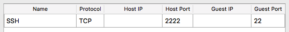
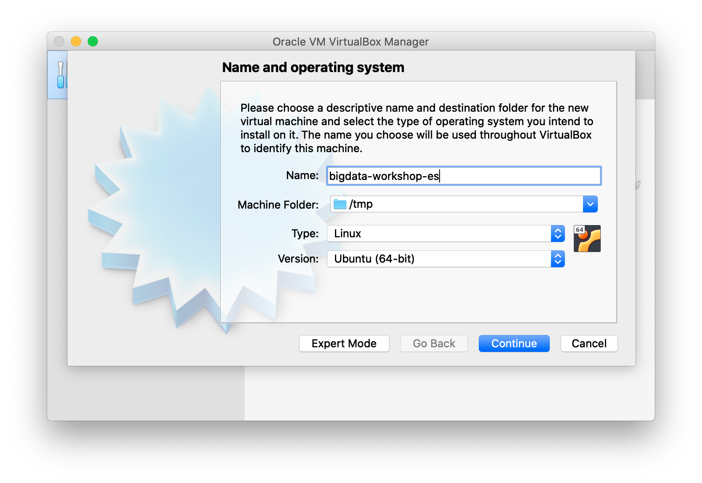
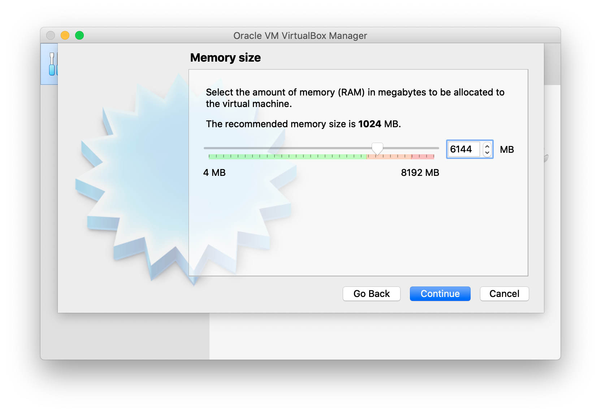
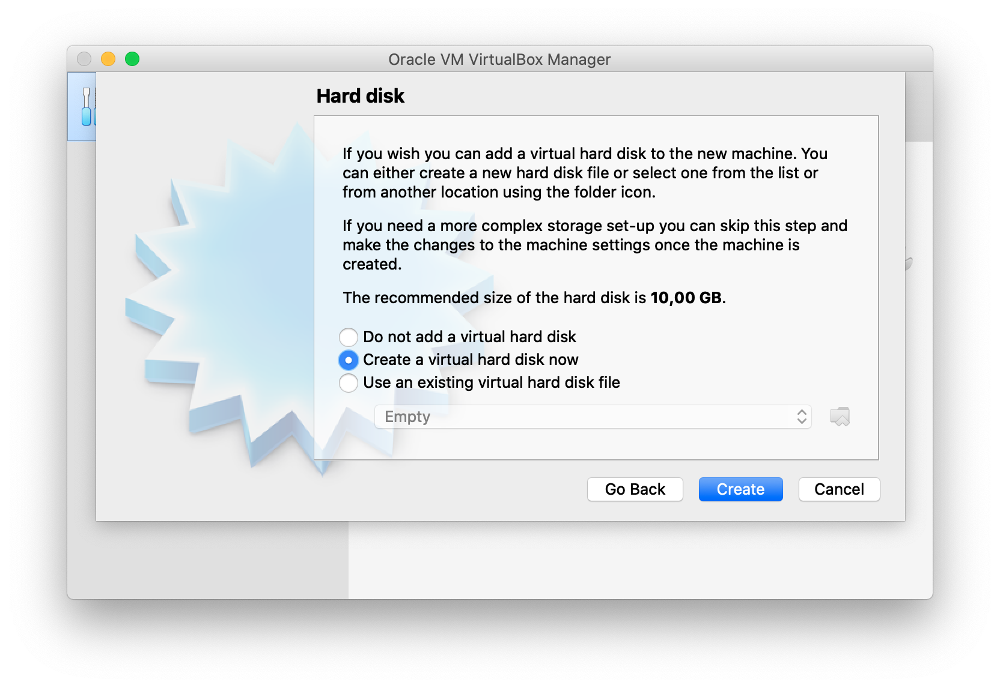
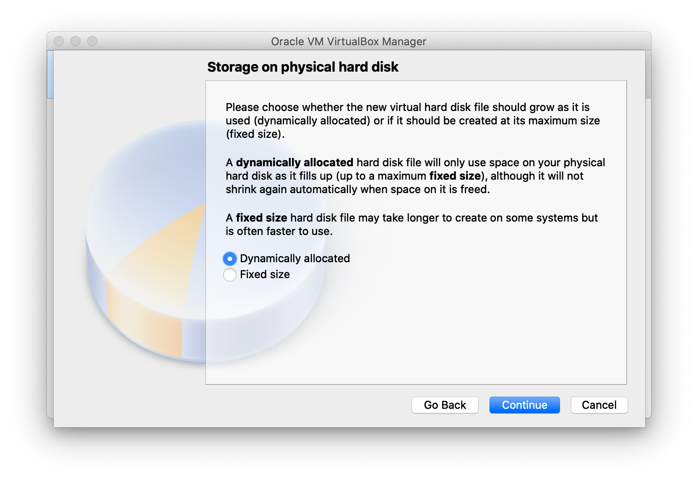
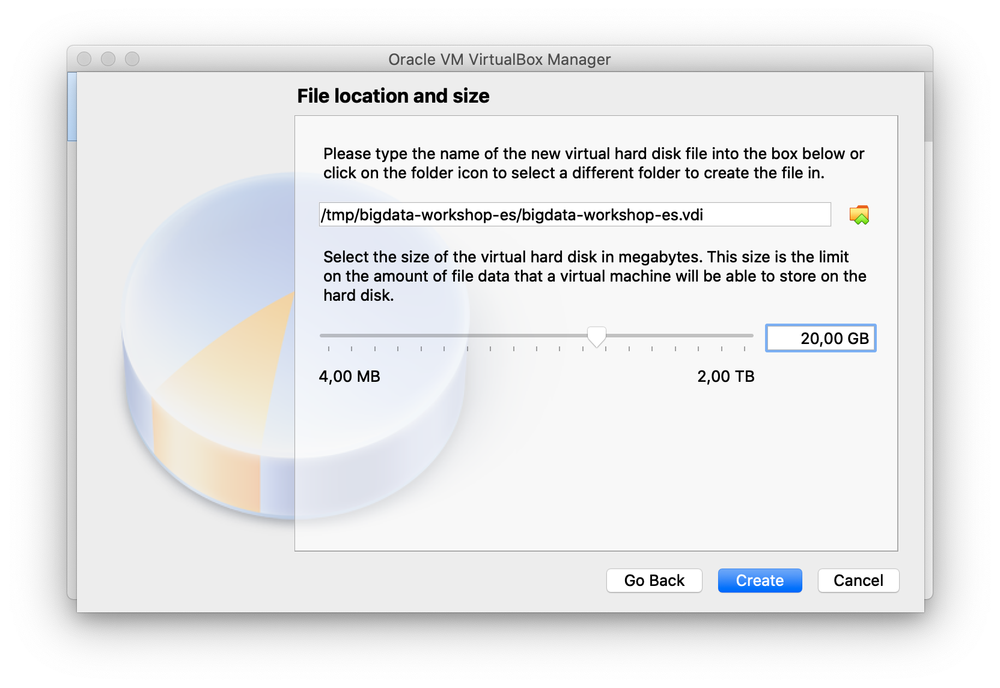
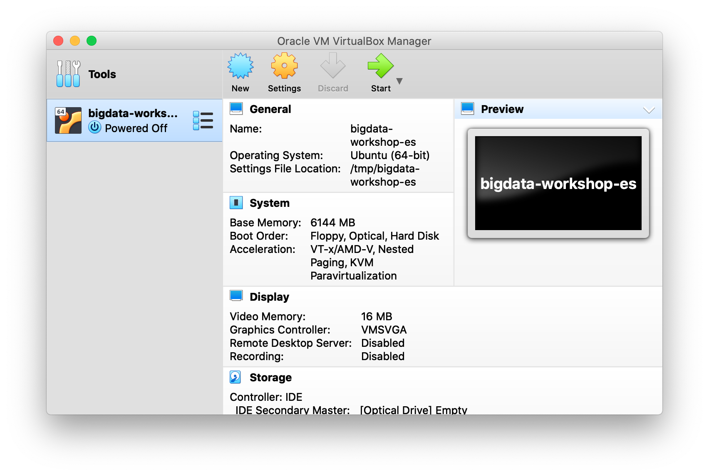

# Creando VM de cero

* Download una version de Ubuntu Desktop

`wget -c http://releases.ubuntu.com/18.04/ubuntu-18.04.3-desktop-amd64.iso`

## Configurar VirtualBox

* Instalar [VirtualBox](https://www.virtualbox.org)
* Configurar disco de **>= 20Gb** y **8Gb RAM**
* Configurar red: Settings > Network > **Port Forwarding**

* Instalar la VM
* Abrir la terminal y ejecutar los comandos de [install-script.sh](install-script.sh)

## Acceso por SSH

* Despues de habilitar SSHD (corriendo script arriba) se puede acceder a la VM por SSH: `ssh analyst@localhost -p 2222`

## Sobre
Gustavo Arjones &copy; 2017-2020  
[arjon.es](https://arjon.es) | [LinkedIn](http://linkedin.com/in/arjones/) | [Twitter](https://twitter.com/arjones)
